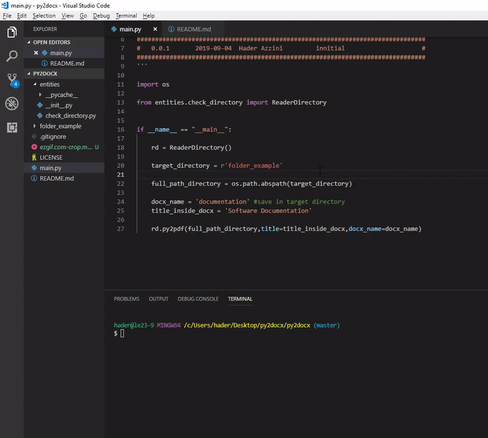

# py2docx
This code reads all .py files in a folder and pastes the contents into a .docx file. This is useful for software documentation. Some Intellectual Property Regulators require code in document (A4 format)

